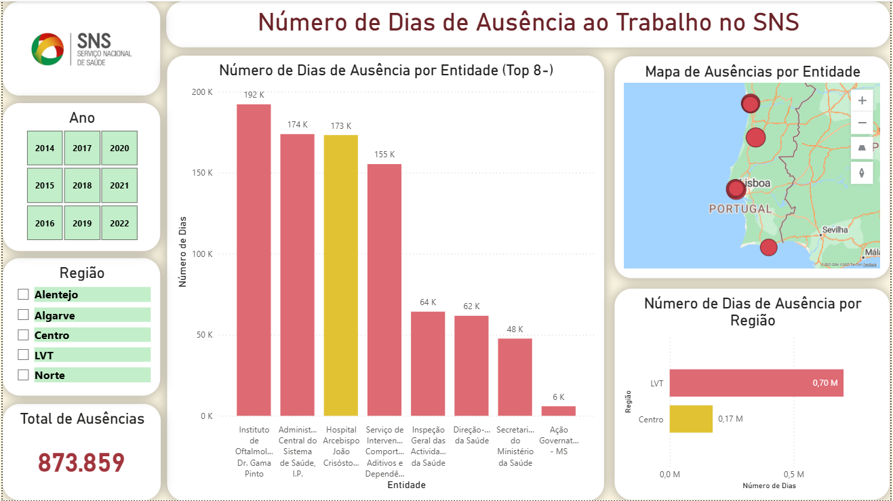

# Análise ao Número de Dias de Ausência ao Trabalho dos Profissionais do SNS
Projeto desenvolvido durante uma Microcredencial em Business Intelligence, com foco na análise no número de dias de ausência ao trabalho dos profissionais do Sistema Nacional de Saúde (SNS).

## Constituição da base de dados
- **Fonte:** Base de dados pública do SNS
- **Tempo:** 2014-2022 (dados mensais)
- **Regiões:** 5 (Norte, Centro, Lisboa e Vale do Tejo (LVT), Alentejo e Algarve)
- **Entidades:** 68 (Norte: 18, Centro: 13, LVT: 27, Alentejo: 5, Algarve: 2)
- **Tipologia de Ausência:** Acidente de Trabalho/Doença Profissional; Assistência a familiares; Casamento; Com perda do vencimento; Cumprimento de pena disciplinar; Doença; Falecimento de Familiar; Greve; Injustificadas; Por conta do período de férias; Proteção na parentalidade; Trabalhador-estudante; Outras. 

## Principais Questões Respondidas
- Número total de dias de ausência ao trabalho  
- Número de dias de ausência por ano/trimestre/mês 
- Número de dias de ausência por entidade 
- Número de dias de ausência por região 
- Número de dias de ausência por tipologia 
- Número de dias de ausência por tipologia por região 
- Número de dias de ausência por tipologia e por região, por ano/ trimestre/ mês 
- Número de dias de ausência por entidade por região
- Número de dias de ausência por entidade por ano

## Procedimento
Criação do modelo em estrela:
- Criação das dimensões: DimeTempo, DimRegião, DimEntidade, DimeTipologiaAusência
- Criação da tabela de factos, onde o único facto é o número de dias de ausência ao trabalho

Utilização do **Power Query** para a criação das dimensões e da tabela de factos (processo ETL).  
Construção de dashboards interativos no **Power BI**, com segmentações por ano, região e tipologia.

## Descrição dos Dashboards

### Dashboard 1: Evolução das Ausências
Apresenta a evolução do número de dias de ausência ao trabalho por:
- Ano
- Ano e região
- Trimestre
- Trimestre e região

**Filtros de segmentação:**
- **Tipologia:** Permite observar a evolução do número de ausências associado a cada tipologia
- **Região:** Permite filtrar as observações por região
É possível ainda combinar os filtros **Tipologia** e **Região** e obter, por exemplo, a evolução do número de faltas por Greve na região Norte.

### Dashboard 2: Top8+ e Dashboard 3: Top8-:
Estes dashboards refletem:
- As entidades que necessitam de mais controlo e intervenção (**Top 8+**);
- As entidades que podem ser referência de boa gestão (**Top 8-**).  
**Nota:** As entidades com menos faltas podem possuir também um menor número de profissionais. Para uma análise mais rigorosa seria necessário adicionar o facto “Número de profissionais”.  

**Visualizações:**
- Distribuição das entidades por região
- Distribuição geográfica num mapa  
Com os filtros de **Ano** e **Região** é possível analisar isoladamente ano a ano, por região, ou ambos.

### Dashboard 4: Tipologia Ausência
Apresenta:
- As tipologias de ausência com maior e menor proeminência
- O trimestre com maior número de ausências registadas

**Filtros de segmentação:**
- **Ano**
- **Trimestre**
- **Região**

## Ferramentas Utilizadas
- **Power BI**
- **Power Query** (ETL e modelação de dados)
